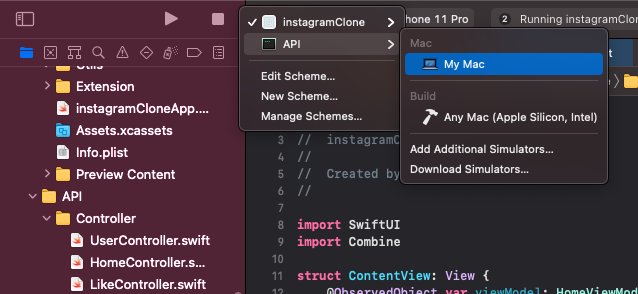
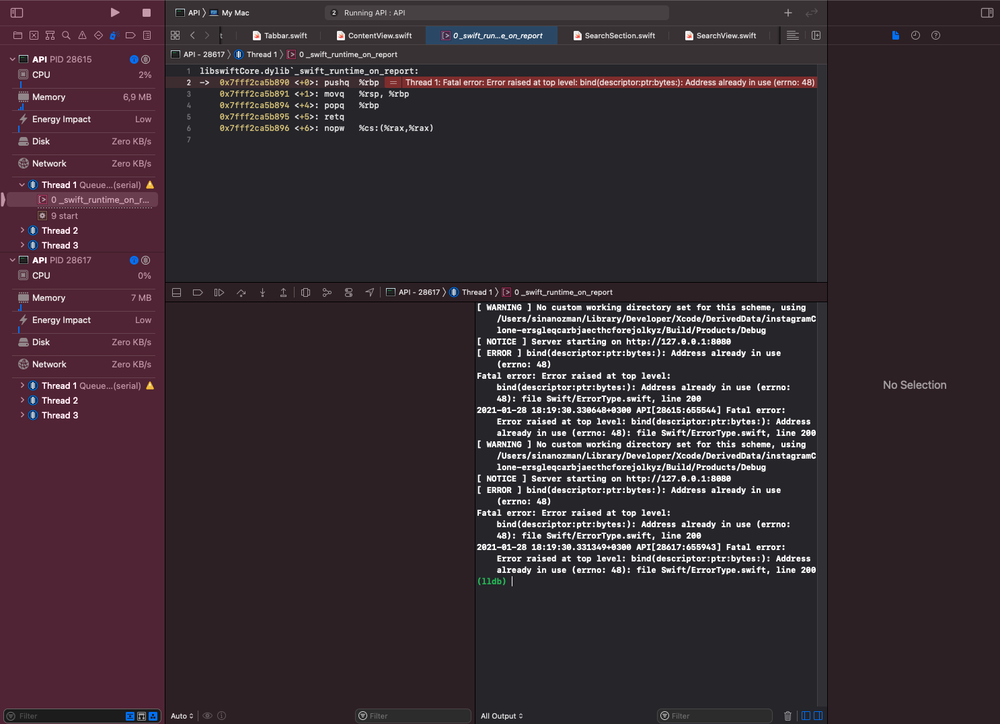
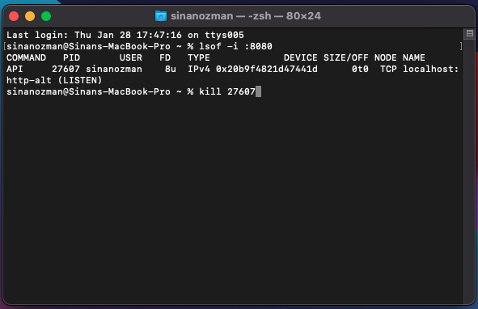
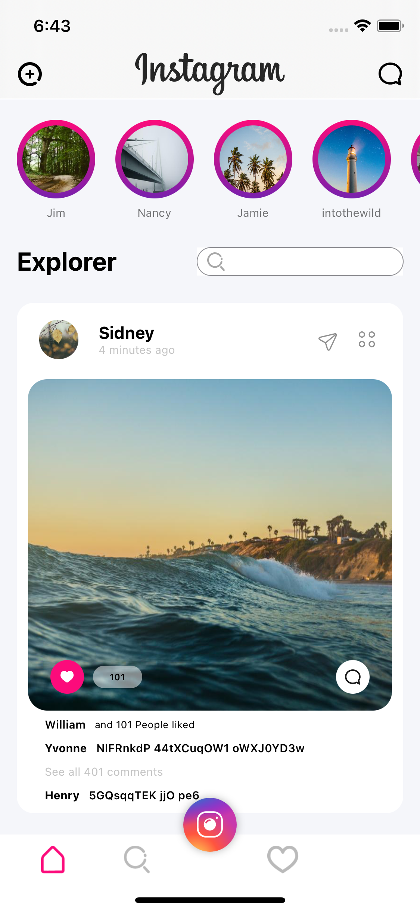
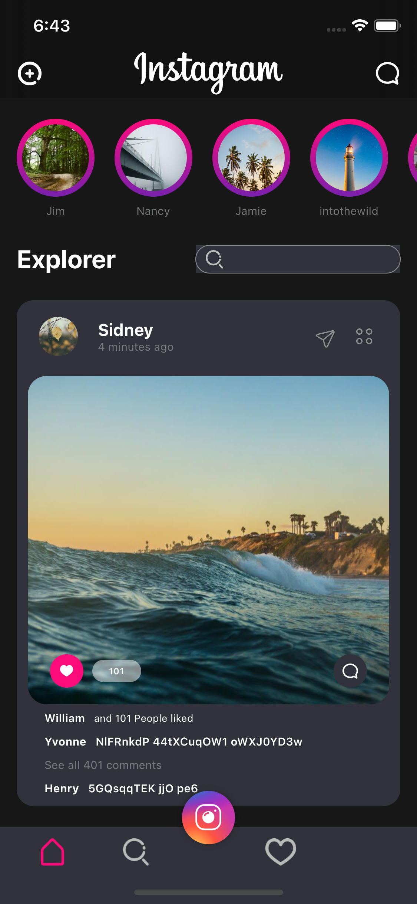
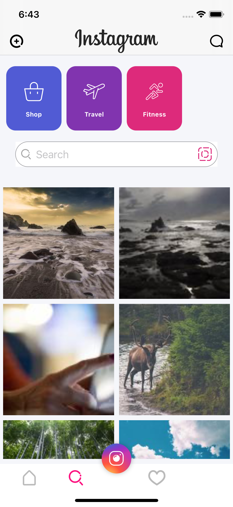
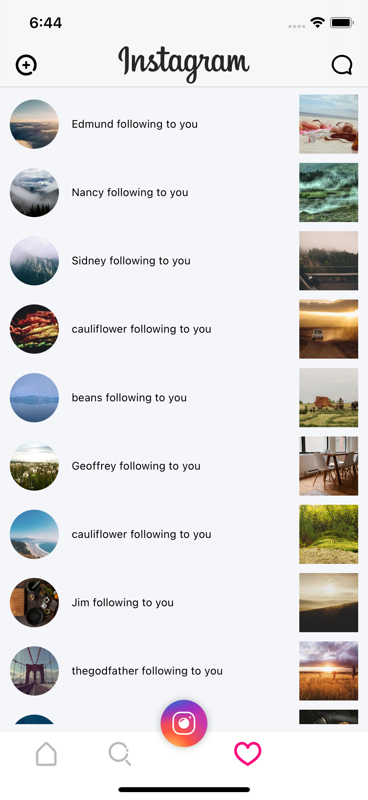
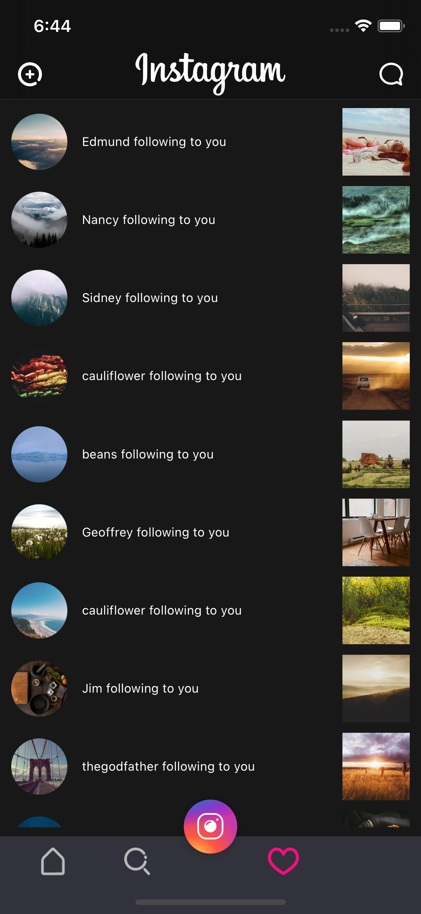
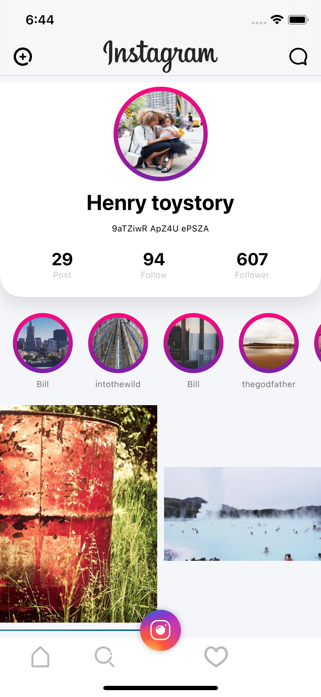
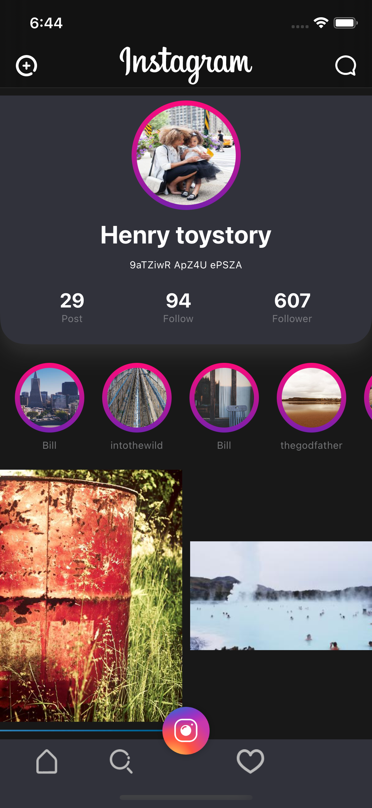

# Instagram Clone

## Overview
A clone of the instagram app built with swiftUI and Vapor Framework for dummy datas

## Features:
* SwiftUI
* Declerative views
* Dummy Data API with VAPOR
* Dark Mode
* To navigate pages
* Combine

## Requirements
* iOS 13+
* Xcode 11.0+
* Swift 5.0+

## Clone the repository

`git clone https://github.com/sozman/instagram-clone-swiftUI.git`

## Build and Run

First of all you should run API target where is on the project. After that you should run InstagramClone target

### API Error

* If you get an error which is Address already in use, you should kill the proccesse.

1. get proccesse's PID
`lsof -i :8080 `
2. kill proccesse 
`kill PID `

## Screenshots

### Home
|  |  | 
|:---:|:---:|

### Search
|  |  | 
|:---:|:---:|

### Notification
|  |  | 
|:---:|:---:|

### Profile
|  |  | 
|:---:|:---:|

## Author
Sinan Özman, sinanozman@icloud.com

## License
Instagram-clone-swiftUI is available under the MIT License, see LICENSE for more information.
